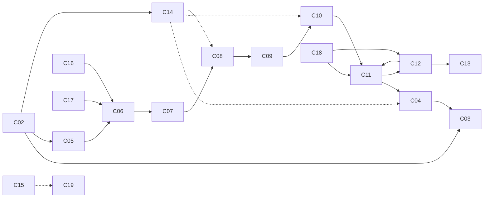

# Component registry

> **Status:** Draft
> **Owner:** Architecture
> **Last reviewed:** 2026-08-03
> **Related:** ARCHITECTURE-OVERVIEW.md, DATA-FLOW.md, FEATURE-REGISTRY.md,
> ../experiments/PHASE1-FINDINGS.md

Twenty components. Each entry: responsibility, inputs, outputs, public interface,
threading, performance sensitivity, memory ownership, failure modes, test strategy,
dependencies, open questions.

Performance sensitivity is rated **Critical** (on the per-frame hot path, directly bounds
goodput), **High**, **Medium**, **Low**.

---

## C01 — Android application shell
**Responsibility.** Lifecycle, permissions, file selection, storage access, UI, session
orchestration, keeping the screen on and at fixed brightness.
**Inputs.** User interaction, Android lifecycle callbacks, progress from the native core.
**Outputs.** Session start/stop commands, selected file descriptors, UI state.
**Interface.** `FileFlowSession` (Kotlin): `startTransmit(uri, profile)`,
`startReceive(config)`, `cancel()`, `observeProgress(): Flow<Progress>`.
**Threading.** Main thread; native calls dispatched off-main.
**Performance.** Low — must not be on the per-frame path at all.
**Memory.** Owns file descriptors and Android resources only.
**Failure modes.** Permission denied; activity backgrounded mid-transfer; storage full;
file unreadable; screen timeout.
**Tests.** Instrumented lifecycle tests; permission-denial paths; backgrounding during
transfer.
**Dependencies.** Android SDK, C02, C15.
**Open questions.** What is the correct behaviour on backgrounding — pause or abort?

## C02 — Device capability probe
**Responsibility.** Determine what this device can actually do, and classify it into a
supported tier. Refuse or degrade rather than fail obscurely later.
**Inputs.** `CameraCharacteristics`, `Display.Mode` list, `INFO_SUPPORTED_HARDWARE_LEVEL`,
SoC/ABI info, thermal API.
**Outputs.** `DeviceProfile`: supported grids, max verified `Fd`, camera modes and formats,
manual-control availability, timestamp source, rolling-shutter skew, tier classification.
**Interface.** `DeviceProfile probe()`; serialisable for telemetry and bug reports.
**Threading.** Once at startup, off-main.
**Performance.** Low, but **correctness-critical** — everything downstream trusts it.
**Memory.** Trivial.
**Failure modes.** **Vendors misreport capabilities** (RISK-011). A device advertising
`MANUAL_SENSOR` may ignore settings; an advertised 120 fps mode may not deliver distinct
frames. The probe must therefore *verify by measurement* where feasible, not just read
characteristics.
**Tests.** Recorded characteristic sets from real devices replayed as fixtures; assertion
that unknown devices get the conservative tier.
**Dependencies.** Camera2, Display APIs.
**Open questions.** OQ-001, OQ-002, OQ-015 — how much active verification is worth doing
at startup versus at session negotiation?

## C03 — Transmitter renderer
**Responsibility.** Present optical frames at the requested rate, at native resolution,
with no scaling, and report which frames were actually presented.
**Inputs.** Cell value matrix; presentation schedule.
**Outputs.** Presented frames; presentation confirmations and timestamps.
**Interface.** `present(CellMatrix, targetVsyncId)`; `PresentationReport lastReport()`.
**Threading.** Dedicated render thread driven by Choreographer (`AChoreographer_postVsyncCallback`, API 33).
**Performance.** **Critical** — bounds `Fd` directly.
**Memory.** Owns GL/Vulkan resources, texture staging buffers, swapchain.
**Failure modes.** Missed vsync; refused frame-rate request; mid-transfer display mode
change; unwanted scaling; VRR idling down.
**Tests.** Perfetto traces verifying presented-frame cadence; automated check that surface
size equals panel native resolution.
**Dependencies.** OpenGL ES 3.x (or Vulkan), `SurfaceView`, Choreographer.
**Open questions.** OQ-004, OQ-005.

## C04 — Optical frame generator
**Responsibility.** Turn coded payload bits into a complete cell matrix: markers, timing
tracks, phase indicator, header, pilots, guards, payload, CRC.
**Inputs.** Coded payload bits; link profile; sequence number; session ID.
**Outputs.** Cell value matrix.
**Interface.** `CellMatrix generate(PayloadBits, LinkProfile, FrameMeta)`.
**Threading.** TX encode thread, one to two frames ahead of the renderer.
**Performance.** High — must stay ahead of the renderer.
**Memory.** Pooled matrices, double/triple buffered.
**Failure modes.** Falling behind the renderer (→ repeated frame → wasted display state);
profile change mid-frame.
**Tests.** **Golden-frame vectors** — deterministic bit input to exact expected matrix.
Round-trip against the sampler with an identity channel.
**Dependencies.** C11 encoder side, profile definitions.
**Open questions.** Which of the three candidate layouts (OQ-003).

## C05 — Camera capture service
**Responsibility.** Configure the camera with locked manual settings and deliver frames
with minimum latency and copying, over both the CPU and GPU paths.
**Inputs.** `DeviceProfile`, capture configuration.
**Outputs.** Frame references (`AImage` or GPU texture) plus capture metadata
(timestamp, exposure, drop indication).
**Interface.** `CaptureSource` — the same interface implemented by the simulator and the
replay harness.
**Threading.** Camera callback thread; **hands off immediately, does no processing**.
**Performance.** **Critical.** Work done here costs camera frames, which costs `Pc`.
**Memory.** Owns the image reader / texture pool; must return buffers promptly or the
camera pipeline stalls.
**Failure modes.** High-speed session rejecting `ImageReader` `[FACT]`; format
unavailable at requested rate; manual controls silently ignored; frame drops; camera
service death; another app stealing the camera.
**Tests.** Frame-cadence and drop-rate measurement; verification that requested manual
settings are reflected in returned `CaptureResult` metadata.
**Dependencies.** Camera2 / NDK Camera, `AImageReader`, `SurfaceTexture`.
**Open questions.** OQ-001, OQ-002, OQ-016, OQ-017.

## C06 — Screen acquisition and tracker
> **Status 2026-08-02: acquisition AND tracking IMPLEMENTED**
> (`core/src/detect.cpp` `ScreenDetector`, `core/src/tracker.cpp` `ScreenTracker`).
> State machine `searching → tracking → degraded → lost`, deliberately quick to drop a lock:
> holding a drifting homography is worse than paying for reacquisition. A corner-jump
> plausibility check stops the tracker snapping onto a different bright object.
>
> **Search region: a boundary ANNULUS**, scaled about the quad's centroid so it follows a
> rotated screen (a bounding-box annulus does not, and an angled receiver is the common case).
> Tracked frames reuse the acquisition threshold rather than recomputing Otsu, which is sound
> because exposure is locked, and self-correcting because drift fails marker verification.
>
> **Measured (F13):** pixels examined, tracked ÷ full acquisition — **0.185** headline,
> **0.554** even when the screen fills 64% of the frame. The first bounding-box implementation
> saved *nothing* in that regime; the annulus fixed it. The saving is a property of the search
> region, not of tracking per se.
>
> Design note (findings F9/F10): localisation and orientation were **split**. Localisation
> uses the persistent boundary ring; orientation scores the four rotations against the corner
> markers. Verification is mandatory — a detection must clear an absolute score *and* beat
> the runner-up by a margin, else it reports `kMarkersNotFound`. Measured worst cell-centre
> error vs ground truth: **< 0.25 cells** head-on; survives 20° yaw + 12° pitch.

**Responsibility.** Find the transmitting screen, maintain a homography across frames,
detect degradation, reacquire after loss.
**Inputs.** Camera frames.
**Outputs.** Homography, tracking state, confidence, motion estimate.
**Interface.** `TrackResult track(FrameView)`; states `SEARCHING/ACQUIRED/TRACKING/DEGRADED/LOST`.
**Threading.** Decode pool; sequential per frame (carries state).
**Performance.** **Critical.**
**Memory.** Small persistent state; scratch buffers pooled.
**Failure modes.** Loss under motion; false lock on a reflection or another screen;
drift; occlusion; reacquisition thrash.
**Tests.** Replay harness with recorded difficult captures; simulator sequences with
known ground-truth homography — enabling exact geometric error measurement.
**Dependencies.** C05 or simulator, marker definitions.
**Open questions.** OQ-008, OQ-020.

## C07 — Frame-phase classifier
**Responsibility.** Decide whether a camera frame holds one display state (clean), several
(mixed), or one already decoded (duplicate); estimate the transition band position.
**Inputs.** Frame, timing tracks, phase indicator cells, camera timestamps, prior state.
**Outputs.** Classification, phase estimate, transition-band rows, confidence.
**Interface.** `PhaseResult classify(FrameView, TrackResult, PhaseHistory)`.
**Threading.** Decode pool; sequential (needs history).
**Performance.** **Critical** — dropping duplicates early is one of the cheapest wins
available, and misclassifying mixed frames as clean poisons the decoder with confident
wrong bits.
**Memory.** Ring buffer of recent phase history.
**Failure modes.** Misclassification in either direction; clock drift; `UNKNOWN`
timestamp source removing the clock cross-check.
**Tests.** Simulator with known rolling-shutter mixtures and known ground truth —
classification accuracy is directly measurable. EXP-008.
**Dependencies.** Frame layout timing tracks.
**Open questions.** Can phase be estimated from optics alone when clocks are uncorrelated?

## C06a — Frame pipeline (shared image→symbols stage)
> **Status 2026-08-02: IMPLEMENTED** (`core/src/pipeline.cpp`, `FramePipeline`).
> Not in the original registry; extracted when the replay harness needed the same
> detect→rectify→sample→normalise chain the simulator already had. Three sources feed the
> decoder — Android camera, simulator, replay harness — and **all three now drive this one
> object**. If each assembled its own tracker/sampler/field they would drift, and the moment
> they drift a replayed capture stops proving anything about live behaviour, which is the
> whole premise of ADR-0010.
>
> Per-stage failure accounting is deliberately split (`geometry_failures` vs
> `photometric_failures`): the screen not being found and the screen not being readable point
> at completely different causes.

## C08 — Rectifier and cell sampler
> **Status 2026-08-02: IMPLEMENTED, CPU path only** (`core/src/sampler.cpp`, `CellSampler`).
> Samples *through* the homography rather than warping the image first — ~4 samples per cell
> instead of ~100 pixels, no second interpolation generation, and the same shape a GPU shader
> needs for the ≥120 fps path (ADR-0005). The GPU path and the mandatory CPU/GPU equivalence
> test are still outstanding.

**Responsibility.** Map each logical cell to image coordinates and produce a representative
sample, with subpixel accuracy and crosstalk suppression.
**Inputs.** Frame, homography, distortion model, grid geometry.
**Outputs.** Raw cell sample array.
**Interface.** `void sample(FrameView, Geometry, SampleBuffer&)` — CPU and GPU
implementations behind one interface.
**Threading.** Decode pool (CPU) or GPU queue (shader).
**Performance.** **Critical** — the single largest per-frame cost. ~34,560 gathers/frame.
**Memory.** Pre-allocated sample buffers; GPU path owns a readback buffer.
**Failure modes.** Sub-pixel registration error; moiré; interior margin mis-tuned;
GPU readback stall serialising the pipeline.
**Tests.** Simulator with identity and known-warp channels; CPU/GPU output equivalence
test (must match within tolerance) — this is a critical regression guard.
**Dependencies.** C06, C09.
**Open questions.** OQ-019 (interior margin), EXP-015, EXP-016.

## C09 — Photometric calibration system
> **Status 2026-08-02: IMPLEMENTED** (`core/src/photometric.cpp`, `PhotometricField`).
> Estimates dark and bright levels as smooth FIELDS interpolated from the pilot lattice, so
> it corrects lens vignetting and transmitter-side angular falloff (RISK-025) identically
> without assuming a cause. Carries a **pilot-fit residual** per lattice node: where pilots
> disagree with their own fitted level the region is erased rather than decoded against a
> confidently-wrong reference (finding F8). That residual is the receiver's first real
> detection-confidence signal, and it generalises to occlusion, glare hotspots and tracking
> error alike.

**Responsibility.** Remove exposure, vignetting, gamma and white-balance effects; produce
regional decision thresholds and per-region quality estimates.
**Inputs.** Cell samples, pilot cell positions and expected values.
**Outputs.** Normalised samples, regional thresholds, per-region SNR and blur estimates.
**Interface.** `PhotoResult calibrate(SampleBuffer&, PilotLayout)`.
**Threading.** Decode pool.
**Performance.** High.
**Memory.** Small; illumination-field coefficients and threshold maps.
**Failure modes.** Insufficient or badly-distributed pilots; glare saturating a region
(unrecoverable — must be detected and erased, not "corrected"); device ignoring the
requested linear tone curve.
**Tests.** Simulator with synthetic vignetting, gamma and glare of known parameters;
measure recovered versus true field.
**Dependencies.** C08, frame pilot layout.
**Open questions.** How many pilots, and where — a frame-layout decision (OQ-003).

## C10 — Soft symbol demodulator
**Responsibility.** Convert normalised samples into LLRs and erasure flags for the active
modulation mode.
**Inputs.** Normalised samples, thresholds, quality estimates, phase result, link profile.
**Outputs.** LLR array + erasure flags.
**Interface.** `void demodulate(PhotoResult&, LinkProfile, LlrBuffer&)`.
**Threading.** Decode pool; parallel across cells.
**Performance.** **Critical.**
**Memory.** Pre-allocated LLR buffers (8-bit quantised, provisional).
**Failure modes.** Over-confident LLRs (worse than under-confident); mode/profile
mismatch; multilevel threshold drift; quantisation loss.
**Tests.** Simulator sweep of SNR versus measured LLR calibration — a well-calibrated
demodulator's LLRs should match empirical error probabilities. This is directly testable
and rarely tested; it belongs in CI.
**Dependencies.** C09, MODULATION-SPEC.
**Open questions.** Is 8-bit LLR quantisation sufficient (EXP-011)?

## C11 — Intra-frame FEC decoder (and encoder)
**Responsibility.** Correct within-frame errors using soft input; produce packets with
status; report uncorrectable frames as erasures.
**Inputs.** LLRs + erasure flags; code parameters.
**Outputs.** Packets + per-packet outcome; frame-level erasure signal.
**Interface.** `FrameDecodeResult decode(LlrBuffer&, CodeParams)`.
**Threading.** Decode pool; parallel across frames, possibly across codewords.
**Performance.** **Critical** — RISK-015 is that this is too slow.
**Memory.** Pre-allocated decoder working set; iteration buffers pooled.
**Failure modes.** Too slow under thermal throttle; miscorrection (producing wrong data
that passes the code's own checks — which is why a CRC sits above it); iteration limits.
**Tests.** Deterministic error-pattern vectors; ARM64 timing benchmarks; miscorrection
rate measurement.
**Dependencies.** Selected code family (EXP-011).
**Open questions.** OQ-009, OQ-014.

## C12 — Fountain decoder (and encoder)
**Responsibility.** Recover source blocks from any sufficient set of received symbols,
tolerating loss, duplication and reordering.
**Inputs.** Packets with sequence and fountain metadata.
**Outputs.** Recovered source blocks; completion signal; overhead statistics.
**Interface.** `FountainState ingest(Packet)`; `bool complete()`; `Blocks take()`.
**Threading.** Assembly thread.
**Performance.** High; the tail of the transfer is dominated by this.
**Memory.** **Largest single allocation.** Bounded by negotiated block size, which is
validated against a hard limit before allocation.
**Failure modes.** Overhead worse than modelled; memory blow-up on hostile parameters;
decode stall near completion; **licensing/patent exposure** (RISK-016).
**Tests.** Loss-pattern sweeps; adversarial parameter fuzzing; overhead measurement
(EXP-012).
**Dependencies.** Selected scheme (undecided).
**Open questions.** OQ-010.

## C13 — File reconstruction and verifier
**Responsibility.** Assemble blocks into the output file, verify the cryptographic hash,
and deliver only verified results.
**Inputs.** Source blocks, manifest.
**Outputs.** Verified file, or a hard failure.
**Interface.** `VerifyResult finalize(Blocks, Manifest)`.
**Threading.** Assembly thread; hashing may be incremental during reception.
**Performance.** Medium — but included in total transfer time, so not free.
**Memory.** Streams to a temporary file; bounded RAM.
**Failure modes.** Hash mismatch (**must fail loudly, never deliver**); storage full;
temp-file collision or symlink attack; length mismatch.
**Tests.** Corruption injection must always be detected; storage-full handling;
temp-file safety tests.
**Dependencies.** C12, security rules.
**Open questions.** Streaming versus final hashing — how early can we detect a bad transfer?

## C14 — Adaptive link controller
> **Status 2026-08-03: DECISION FUNCTION IMPLEMENTED. ACTUATION BLOCKED BY THE PROTOCOL.**
> (`core/src/link.cpp` — `ChannelEstimator` for ADP-01, `LinkController` for ADP-02.)
> Measured in EXP-023; findings F20–F23.
>
> **What works.** The receiver can score the entire code-rate ladder from a run made at a single
> rung, because `IntraFec` derives its codeword count from frame capacity alone and `nsym`
> shrinks only the message — so the per-codeword damage pattern is **invariant in `nsym`**. A
> codeword decodes at `nsym = n` exactly when `2·errors + erasures ≤ n`, and neither term depends
> on `n`. **One 256-bin histogram of the worst per-frame codeword budget is therefore a
> sufficient statistic for every candidate rung**, at one increment per frame and zero
> allocation. **Measured: the optimum found exactly (rung distance 0) on all three EXP-023
> channels that complete a verified transfer**, from telemetry alone.
>
> **What does NOT work, and cannot without a protocol change.** `nsym` sets the FEC message
> size → the fountain symbol size → a manifest field fixed for the whole session (an XOR-based
> erasure code cannot combine unequal-length symbols). Modulation profile and grid have the same
> consequence. So **the mid-session control loop this entry specifies is not implementable
> against the current protocol**; code-rate selection is a *session-start* decision, and on a
> one-way link the transmitter cannot hear the receiver's answer at all (OQ-013). The controller
> therefore **reports** rather than actuates, and `ffsim --adapt` says so in its output. OQ-037
> proposes the fix.
>
> **Three failure modes, all now guarded.** Optimising symbol error rate instead of goodput
> (the objective is expected payload bytes per display state, tested); oscillation (asymmetric
> margins plus dwell — the test requires a margin-free controller to flap on the same channel,
> so the result is not an artifact of an easy scenario); and a third one this entry did not
> anticipate — **silent under-promotion**, where a hysteresis margin larger than the ladder's
> rung spacing parks the controller below the achievable rate forever with nothing looking wrong
> (F22). `Create` now rejects that configuration.
>
> **Deliberately absent: `ThermalState`.** The registry interface below names it, and the
> implementation omits it, because the ARM64 decode-cost numbers that would justify any thermal
> policy come from EXP-011 and EXP-020 and neither has run. An invented policy would be a design
> decision living only in code. OQ-036, ADP-05.
>
> **Known limitation, surfaced not buried.** A frame that does not decode cannot have its budget
> *measured* — decoding is how it gets measured — so it contributes a lower bound. Such
> observations are counted (`censored_observations`) and reported, because the bias is
> directional: an estimate taken at a rung that loses frames is trustworthy for **weakening** the
> code and optimistic for **strengthening** it.

**Responsibility.** Select modulation profile, grid and code rate from measured channel
state; decide when to fall back.
**Inputs.** Telemetry from C06–C12; thermal state.
**Outputs.** `LinkProfile` selection; fallback and abort decisions.
**Interface.** `LinkProfile select(ChannelState, ThermalState)`.
**Threading.** Low-frequency control loop, not per-frame.
**Performance.** Low cost, **high leverage** — a bad controller destroys goodput.
**Memory.** Trivial.
**Failure modes.** Oscillation between profiles; optimising symbol error rate instead of
goodput; slow reaction to degradation; **with a one-way link, no channel feedback at all**.
**Tests.** Simulator with scripted channel degradation; verify the controller converges
and does not oscillate.
**Dependencies.** All telemetry producers.
**Open questions.** **OQ-013 — how the transmitter learns channel state on a one-way link.
This is the least-designed part of the architecture**, though EXP-023 narrowed it: estimation is
solved, delivery is not. **OQ-037** — decoupling the fountain symbol size from frame capacity,
which is what blocks actuation before the one-way link even becomes the problem. **OQ-036** —
the thermal policy this component is specified to have and deliberately does not.

## C15 — Benchmark and telemetry system
**Responsibility.** Collect, aggregate and persist every metric in the benchmark
methodology; make goodput computations reproducible.
**Inputs.** Per-stage telemetry, system counters, thermal and battery state.
**Outputs.** Structured session records; raw per-frame logs.
**Interface.** `record(Event)`; `SessionReport finish()`.
**Threading.** Low-priority; lock-free per-frame ingest, aggregation off the hot path.
**Performance.** Medium — **must not perturb what it measures.** Per-frame recording uses
pre-allocated ring buffers, never allocation or I/O on the hot path.
**Memory.** Bounded ring buffers; flushed periodically.
**Failure modes.** Observer effect; buffer overflow losing exactly the interesting events;
storage growth.
**Tests.** Overhead measurement with telemetry on versus off — if the difference is
material, the telemetry is wrong.
**Dependencies.** All components.

## C16 — Offline channel simulator
**Responsibility.** Generate optical frame sequences, apply configurable impairments, and
feed the real decode chain — with no device involved.
**Inputs.** Reproducible run configuration; source payload.
**Outputs.** Synthetic camera frames via `CaptureSource`; ground truth; diagnostics.
**Interface.** Implements `CaptureSource`; configuration is a versioned file.
**Threading.** Desktop; parallel across runs.
**Performance.** Medium — sweep throughput matters for productivity, not for goodput.
**Memory.** Desktop-scale; unconstrained.
**Failure modes.** **Modelling the channel we wish we had.** A simulator that is too kind
produces confident wrong conclusions — the worst failure mode in this project. Must be
calibrated against real captures in Phase 2.
**Tests.** Self-consistency (identity channel must decode perfectly); calibration against
recorded real captures.
**Dependencies.** C04, full decode chain, desktop build.
**Open questions.** How faithful must the impairment model be before its conclusions
transfer? Answered empirically in Phase 2.

## C17 — Recorded-frame playback harness
> **Status 2026-08-02: IMPLEMENTED** (`harness/`, `ReplaySource`, `CaptureWriter`, `ffreplay`).
>
> **Format is deliberately boring:** a directory with `capture.meta` (key/value text) and
> `frames/NNNNNN.gray` (raw 8-bit luminance, no header). Raw greyscale because that is exactly
> what the camera gives us — the Y plane of `YUV_420_888` — so there is no decoder dependency
> and no lossy compression to destroy the high-spatial-frequency cell structure we are trying
> to measure. Text metadata because it diffs in git and can be hand-corrected when a rig
> measurement was mistyped.
>
> **Proven faithful:** `ReplayIsBitIdenticalToLiveDecode` decodes frames directly through
> `FramePipeline`, then writes and replays the same images, and requires every cell sample to
> match **exactly** — plus matching diagnostics. Established before any real hardware exists,
> so the first real capture arrives on a path already known to be sound.
>
> **Unrecorded metadata stays visibly unset** (negative sentinels, empty strings) and
> `ffreplay` prints a loud incomplete-metadata warning. A half-labelled dataset must not
> quietly become a cited result.
>
> A missing or corrupt frame file is treated as a **drop, not a truncation** — one bad file
> cannot silently discard the rest of a good dataset.
>
> `ffsim --record DIR` writes a synthetic bundle, which is how the harness is exercised in CI
> today and how the Android recorder will get a byte-compatible reference to produce against.

**Responsibility.** Replay prerecorded camera frames through the decode chain exactly as
the live receiver would.
**Inputs.** Recorded frame sets + full metadata.
**Outputs.** Deterministic decode results.
**Interface.** Implements `CaptureSource`.
**Threading.** Desktop or device.
**Performance.** Low.
**Memory.** Streams from disk.
**Failure modes.** Metadata drift from the recording; **lossy-compressed recordings**
destroying the high-spatial-frequency content we are measuring (see camera research);
storage volume of raw captures.
**Tests.** Byte-identical results across runs; same results on device and desktop.
**Dependencies.** Capture format definition, C05 recording mode.

## C18 — Test-vector generator
**Responsibility.** Produce deterministic, versioned vectors for every protocol layer.
**Inputs.** Seeds, layer specifications.
**Outputs.** Vector files with expected outputs.
**Interface.** CLI; outputs committed to the repository.
**Threading.** N/A.
**Performance.** Low.
**Memory.** Low.
**Failure modes.** Vectors drifting from the spec; non-determinism across platforms
(especially floating-point); vectors regenerated to match a bug rather than the spec.
**Tests.** Cross-platform determinism check.
**Dependencies.** Protocol spec.

## C19 — Experiment result store
**Responsibility.** Hold raw and processed experimental results immutably, linked to
experiment IDs and commits.
**Inputs.** Benchmark and simulator output.
**Outputs.** Queryable results; regeneratable summary tables.
**Interface.** Directory layout under `data/experiments/<EXP-ID>/` plus a schema.
**Threading.** N/A.
**Performance.** N/A.
**Memory.** N/A.
**Failure modes.** **Results deleted or overwritten** — prohibited (CONTRIBUTING); missing
provenance making a result uninterpretable; schema drift.
**Tests.** Schema validation; provenance completeness check in CI.
**Dependencies.** C15.

## C20 — Documentation index
**Responsibility.** Keep every document discoverable, current and cross-linked.
**Inputs.** The docs tree.
**Outputs.** `docs/INDEX.md`, `docs/DOCUMENT-MAP.md`.
**Interface.** Markdown; link-checking CI job **exists** (`tools/check_links.py`, the `docs`
job, every push — DOC-04). It checks that links *resolve*, not that content is current: the
divergences corrected on 2026-08-03 (a stale "what has not been validated" list, a repo-layout
tree naming directories that were never created) all had perfectly valid links.
**Threading.** N/A.
**Performance.** N/A.
**Memory.** N/A.
**Failure modes.** **Documentation diverging from implementation** (RISK-020); dead links;
decisions made in chat and never recorded.
**Tests.** Automated link check; review that every ADR referenced by code exists.
**Dependencies.** All documents.

---

## Dependency summary

`C16` and `C17` enter the chain at the same point as `C05`, via `CaptureSource` — that
substitutability is the architectural property that makes offline development possible.
