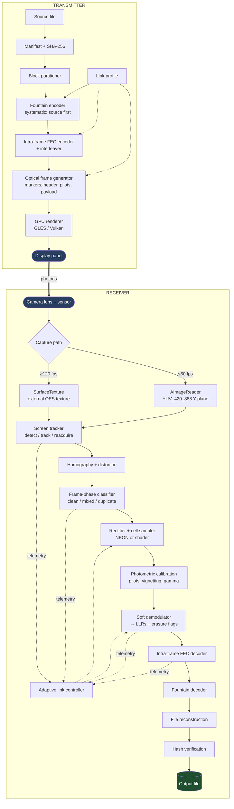
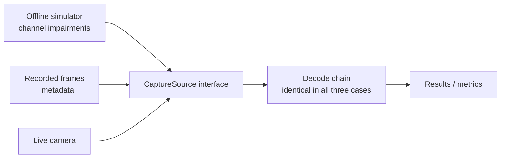

# System data-flow

> **Status:** Draft
> **Owner:** Architecture
> **Last reviewed:** 2026-08-02
> **Related:** ARCHITECTURE-OVERVIEW.md, COMPONENT-REGISTRY.md, PROTOCOL-SPEC.md

## End-to-end flow



## Transmit chain in detail

| Stage | Input | Output | Notes |
|---|---|---|---|
| Manifest + hash | Source file | File metadata, SHA-256 | Hash computed once, up front. Sent in the session header and repeated periodically so a late-joining receiver can still verify. |
| Block partitioner | File bytes | Source blocks of `k` symbols | Block size bounded so fountain decode memory stays bounded. |
| Fountain encoder | Source blocks | Symbol stream, **source symbols first** | Rateless: keeps producing repair symbols until the session ends. |
| Intra-frame FEC encoder | Fountain symbols | Coded payload bits + interleave | Interleaver spreads codewords spatially so clustered damage does not destroy one codeword. |
| Optical frame generator | Coded bits + profile | Cell value matrix | Adds markers, timing tracks, phase indicator, header (heavily protected), pilots, guards, CRC. |
| GPU renderer | Cell matrix | Presented frame | Native resolution, no scaling. Choreographer-paced, presentation verified where possible. |

**Ordering property that matters:** because the fountain layer is systematic and sends
source symbols first, a receiver on a clean channel decodes with almost no fountain
decoding work at all. The expensive path is only taken when the channel is bad.

## Receive chain in detail

| Stage | Input | Output | Failure handling |
|---|---|---|---|
| Capture | Sensor | Frame reference (CPU buffer or GPU texture) | Dropped frames counted, never silently ignored — they are a `Pc` term. |
| Screen tracker | Frame | Homography + confidence | On loss → `SEARCHING`; time in search is logged as zero-goodput time. |
| Frame-phase classifier | Frame + timing | `clean` / `mixed` / `duplicate` + phase estimate | Duplicates dropped early (cheap win). Mixed frames go to M4 handling or are erased. |
| Rectifier + cell sampler | Frame + homography | Raw cell samples | Interior-margin weighted sampling to suppress crosstalk. |
| Photometric calibration | Cell samples + pilots | Normalised samples + regional thresholds | Pilot failure → region marked low-confidence. |
| Soft demodulator | Normalised samples | **LLRs + erasure flags** | Never emits hard bits. Transition-band cells → erasures, not guesses. |
| Intra-frame FEC decoder | LLRs | Packets + per-packet status | Uncorrectable → whole frame becomes an erasure for the fountain layer. |
| Fountain decoder | Packets | Recovered source blocks | Duplicates and out-of-order arrivals tolerated by design. |
| File reconstruction | Blocks | Temp file | Streamed to disk, bounded memory. |
| Hash verification | Temp file + manifest hash | Verified file or failure | **Mismatch is a hard failure.** Never deliver unverified output. |

## Erasure propagation — the important part

Information about *what we do not know* is as valuable as decoded data, and it must survive
every stage rather than being flattened into a guess:

```
tracking confidence  ─┐
blur estimate        ─┤
pilot SNR            ─┼──► per-cell LLR magnitude ──► FEC soft input
frame-phase band     ─┤
motion detection     ─┘                          └──► erasure flags ──► fountain layer
```

A cell in a rolling-shutter transition band, a region under glare, or a frame captured
during motion should arrive at the FEC decoder marked as *unknown*, not as a confident
wrong bit. Confident wrong bits are much worse than erasures: most codes correct roughly
twice as many erasures as errors.

This is the single most important cross-cutting property of the receive chain, and it is
easy to lose accidentally — any stage that thresholds to a hard decision destroys it
permanently.

## Control and telemetry flow

Telemetry is emitted by every stage and consumed by two sinks: the adaptive link
controller (live) and the benchmark/experiment store (recorded). Same data, two consumers.

Per-frame record: timestamps, phase classification, tracking confidence, symbol error rate
estimate, header outcome, FEC iterations and outcome, decode latency per stage, dropped
frame count, thermal and CPU state.

Per-session record: everything in the benchmark methodology, plus the final goodput
computation with its numerator and denominator stated separately — so the number can
always be re-derived.

## Simulation and replay paths



All three sources implement `CaptureSource`. The decode chain cannot tell which one it is
running against, which is exactly the property that makes simulator and replay results
transferable to live behaviour. If a bug reproduces in replay, it is a real bug; if a
change improves simulated goodput, it is a real change.

This diagram is the practical statement of ADR-0010.
