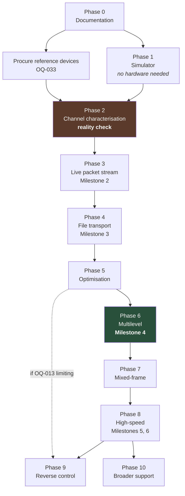

# Implementation roadmap

> **Status:** Draft
> **Owner:** Project lead
> **Last reviewed:** 2026-08-02
> **Related:** FEATURE-REGISTRY.md, EXPERIMENT-REGISTRY.md, RISK-REGISTER.md

**Phases are sequenced by dependency and exit criteria, not by calendar duration.** No
dates appear here deliberately — a phase ends when its exit criteria are met.

Phases 1 and 2 can overlap substantially. Several experiments run off-device and in
parallel; those are noted.

---

## Phase 0 — Research and documentation foundation

**Entry.** Project start.

**Work.** Literature review; platform research from primary sources; architecture
definition; component, feature, experiment, risk and open-question registries; initial ADRs;
optical frame candidates; protocol and modulation specs; performance model; benchmark
methodology; roadmap.

**Exit criteria.**
- [x] Documentation tree and index exist
- [x] Vision, goals/non-goals, terminology, performance philosophy recorded
- [x] Initial ADR set complete (12), each with status and validation plan
- [x] Component registry covers all 20 planned subsystems
- [x] Feature, experiment, risk and open-question registries populated
- [x] Optical frame candidates defined with a selection experiment
- [x] Performance model reproducible from a committed script
- [ ] **Reference devices selected and procured** (OQ-033) — *outstanding*
- [ ] Primary text obtained for the visible-branch prior art (RT-01) — *outstanding*

**Status: substantially complete.** The two outstanding items do not block Phase 1 (which
needs no hardware) but **do** block Phase 2.

---

## Phase 1 — Offline simulator

**Entry.** Phase 0 documentation complete.

**Work.** `CaptureSource` interface; optical frame generator (C04); channel simulator
(C16) with the impairment pipeline; decode chain skeleton (C06–C13) running on desktop;
M0 modulation; intra-frame FEC and fountain layers; deterministic test vectors (C18).

**Exit criteria.**
- Identity-channel round trip decodes perfectly (bit-exact)
- Simulator applies at least impairments 1–7, 13–17, 19–21 (SIMULATOR-PLAN)
- Reproducible run configs; same seed + commit ⇒ identical output
- Sweep capability working
- **EXP-010, EXP-011, EXP-012 complete** — differential schemes ranked, code family
  selected, fountain overhead measured
- Desktop build in CI with ASan/UBSan
- Golden-frame vectors committed

**Key decision point.** EXP-010 either confirms ADR-0008 or supersedes it. If the temporal
differential schemes lose, effort redirects to M2 immediately — which matters because the
model says M2 is required for milestone 4.

**Note.** This phase needs **no hardware** and can start immediately.

> **Status 2026-08-04: MOSTLY BUILT, EXIT CRITERIA NOT MET.** Recorded plainly because Phase 2 work
> started anyway, and a reader is entitled to know the sequence was broken deliberately rather than
> by accident.
>
> **Met:** identity-channel round trip is bit-exact; the impairment pipeline, sweep capability and
> the desktop CI build with ASan/UBSan all exist; same seed plus commit gives identical output
> (there is a determinism gate in CI).
>
> **Not met:**
> - **EXP-010, EXP-011, EXP-012 have not run.** So differential schemes are unranked, no code
>   family has been selected (RS is a working default, OQ-009), and fountain overhead is measured
>   only incidentally (F4: LT overhead 0.54 on an impaired channel, far worse than RaptorQ's ~2%
>   class).
> - **C18's deterministic test vectors do not exist**, and neither do golden-frame vectors.
> - **Reproducible run *config files* do not exist** (SIM-02) — runs are reproducible from flags
>   plus the echoed seed, which satisfies the property but not the artefact.
>
> **The key decision point below is therefore still open.** EXP-010 either confirms ADR-0008 or
> supersedes it, it needs no hardware, and it is cheap. Leaving it unrun while doing hardware work
> means Phase 2 calibrates the simulator against conclusions that are themselves incomplete.

---

## Phase 2 — Static channel characterisation

**Entry.** Phase 1 exit; reference hardware available.

> **Status 2026-08-04: IN PROGRESS.** Entered without Phase 1's exit criteria being met (see
> above), because hardware became available and the probe/recorder work was the shortest path to
> real data.
>
> **Done:** capability probe (C02) built and **run on hardware** (F27); camera capture service with
> manual-control locking **and read-back verification** (C05 CPU path, F28); recorded-frame harness
> (C17) exercised on a real device capture (F29). EXP-007's enumeration half and its CPU-path
> verification half are both complete.
>
> **Not done, in rough order of leverage:** **EXP-006 (`Fd`)** — blocked on a transmitter, and the
> single most important missing number; **EXP-001** (density cliff) — needs real captures of real
> optical frames, and F16 established the simulator *cannot* answer it; **EXP-009** (`Pc`);
> **SIM-03** simulator calibration, which is what would close RISK-024; **BEN-05** QR baseline;
> **CV-01 on hardware** (it is measured only against synthetic ground truth so far); and the
> **≥120 fps high-speed capture path** (OQ-002).

**Work.** Capability probe (C02); camera capture service with manual control locking;
static pattern detection and rectification (CV-01); recorded-frame harness (C17);
simulator calibration (SIM-03); QR baseline (BEN-05).

**Exit criteria.**
- **Milestone 1 met** — reliable static-pattern detection and rectification, with measured
  geometric error across the distance and angle set
- **EXP-007 and EXP-006 complete** — capture path and `Fd` verified per device
- **EXP-001 complete** — maximum resolvable grid found, density cliff located
- **EXP-009 complete** — real `Pc` measured, replacing the model's guess
- **Simulator calibrated** — predicted versus measured symbol error rate reported as a
  number, within a stated tolerance (closes RISK-024)
- **EXP-002 complete** — QR baseline measured
- Capture harness holds a curated set of difficult captures
- Performance model updated with measured `Pc`, `Fd` and grid, and the prediction gap
  recorded

**This is the project's reality check.** If measured `Pc` is far below 0.55, or the density
cliff sits below 96×160, the milestones need renegotiating — and this is the phase where
that becomes known.

---

## Phase 3 — Live binary packet stream

**Entry.** Phase 2 exit.

**Work.** GPU transmitter renderer (TX-01) with presentation verification; live receiver
CPU path; persistent tracking (CV-02); frame-phase classifier (C07); photometric
calibration (C09); soft demodulator (C10); end-to-end M0 packet transmission; telemetry.

**Exit criteria.**
- **Milestone 2 met** — reliable live binary packet transmission, sustained over minutes
- Tracking maintains lock under light handheld motion; reacquisition time measured
- Frame-phase classification accuracy ≥90% on device (EXP-008)
- Per-frame telemetry with measured, negligible observer effect
- Goodput measured and reported per methodology
- EXP-017 complete — tracking versus detection settled

---

## Phase 4 — Reliable arbitrary-file transport

**Entry.** Phase 3 exit.

**Work.** Session layer; file manifest and hashing; streamed reconstruction; hash
verification gate; protocol versioning; input validation hardening; fuzzing; UI for
selection, progress and failure reporting; cross-device benchmark matrix.

**Exit criteria.**
- **Milestone 3 met** — reliable arbitrary-file transfer, verified by hash
- 1 MB, 10 MB and 100 MB transfers complete successfully
- **Zero unverified deliveries** across all testing — corruption always caught
- Fuzzing running continuously with no outstanding crashes
- All bounds in INPUT-VALIDATION enforced and tested
- Cross-device matrix run; device-specific issues identified
- Security review complete

---

## Phase 5 — Throughput optimisation

**Entry.** Phase 4 exit.

**Work.** SIMD and GPU cell sampling (EXP-016, EXP-022); decode pipeline parallelism;
adaptive link controller (C14); the one-way profile schedule (ADP-03); blur and motion
handling; frame layout selection (EXP-013); thermal-aware adaptation.

> **Amended 2026-08-03.** Two items moved out of this phase, in opposite directions.
>
> **C14's decision function landed early** (Phase 1, EXP-023, findings F20–F23) because F18
> supplied its inputs and it needed no hardware. What remains in Phase 5 is only its *thermal*
> half (ADP-05, OQ-036), which is genuinely blocked on EXP-011 and EXP-020 measurements.
>
> **ADP-03 is blocked, not scheduled.** The one-way profile schedule has nothing it can cycle:
> every capacity-changing knob alters the fountain symbol size, which the manifest fixes for the
> session (F20). **A new prerequisite belongs before this phase — OQ-037**, decoupling symbol
> size from frame capacity. It is a protocol change, it is simulator-only work, and it also
> recovers F4's ~27% block-padding waste, so it is cheap relative to its value.

**Exit criteria.**
- Frame layout and grid selected from measured data, with the response surface reported
- Decode keeps pace with capture at target grid with headroom under thermal throttle
- Adaptive controller converges without oscillation under scripted degradation
- Goodput improvement over Phase 4 measured and attributed to specific changes
- **OQ-013 addressed** — the profile-schedule waste quantified and bounded

**Note.** Milestone 4 (200 KB/s) is **unlikely to be met here** — the model says binary at
60 states/s tops out around 145 KB/s. This phase maximises what M0/M1 can do; Phase 6 is
where milestone 4 becomes reachable.

---

## Phase 6 — Multilevel and colour modulation

**Entry.** Phase 5 exit.

**Work.** M2 four-level luminance with per-region slicing and Gray-coded levels; M3 colour
evaluation; constellation derivation (EXP-014); tone-curve linearisation.

**Exit criteria.**
- **Milestone 4 met** — sustained verified goodput > 200 KB/s, median across ≥5 runs, in
  the handheld benchmark category, on ≥2 device pairings
- M2 shown to increase end-to-end goodput over M0/M1 (EXP-013), or explicitly rejected
- M3 evaluated at the cell size chroma subsampling requires, and adopted or rejected on
  measured goodput (EXP-014)
- Adaptive fallback between modes working with hysteresis

**This is the critical phase for the headline target.** If M2 does not pay (RISK-007),
milestone 4 depends entirely on exceeding 60 display states/s, which depends on Phase 8's
prerequisites.

---

## Phase 7 — Mixed-frame recovery

**Entry.** Phase 6 exit; frame-phase classification reliable.

**Work.** M4 mixed-frame-aware demodulation; transition-band localisation; partial-frame
decoding; possible adoption of frame layout Candidate C if tiling proves advantageous here.

**Exit criteria.**
- Measured `Pm` > 0 with a quantified goodput contribution
- Mixed frames yield useful data rather than erasures, at a measured rate
- No regression in clean-frame handling

---

## Phase 8 — High-speed device profiles

**Entry.** Phase 7 exit; EXP-007 confirmed the GPU path delivers distinct 120 fps frames.

**Work.** GPU capture path (RX-02) productionised; GPU cell sampling; 120 Hz display mode
handling; high-speed profile tuning.

**Exit criteria.**
- **Milestone 5 attempted** — sustained verified goodput > 500 KB/s in the controlled
  rigid-mount category
- Milestone 6 investigated and **answered honestly** — either >1 MB/s is demonstrated, or
  it is reported as not achievable on available hardware with the reasons stated

**Hard prerequisite.** If EXP-007 showed the GPU path does not deliver distinct 120 fps
frames, **this phase does not proceed** and milestones 5 and 6 are reported as blocked by
platform capability. That is an acceptable outcome and must be reported as such rather
than worked around.

---

## Phase 9 — Reverse optical control

**Entry.** Phase 8 exit, **or earlier if OQ-013 proves limiting.**

**Work.** Receiver-to-transmitter optical channel (receiver's screen → transmitter's
camera); channel-state feedback; rate adaptation with real feedback; NAK-driven repair;
early completion signalling.

**Exit criteria.**
- Reverse channel established and used for rate adaptation
- Profile-schedule waste eliminated or substantially reduced
- Transfer tail shortened by receiver-signalled completion

**Possible re-prioritisation.** If Phase 5 shows the one-way profile schedule wastes a
large fraction of display states (RISK-022), this phase should move earlier — it directly
recovers that waste, and it also fixes the transfer-tail inefficiency where the transmitter
keeps emitting after the receiver has finished.

---

## Phase 10 — Broader hardware support

**Entry.** Phase 8 exit; core protocol stable.

**Work.** Wider device compatibility; conservative fallback profiles; capability tiering
for unknown devices; possibly lower API levels; optional compression; optional
authenticated encryption and signatures.

**Exit criteria.**
- Works on a defined broader device set with documented expected goodput per tier
- Graceful degradation on devices lacking manual controls
- Optional security features implemented if pursued

---

## Dependency graph

## Milestone mapping

| Milestone | Phase | Confidence |
|---|---|---|
| 1 — static detection and rectification | 2 | High |
| 2 — live binary packet transmission | 3 | High |
| 3 — arbitrary file transfer | 4 | High |
| 4 — >200 KB/s | **6** | **Medium** — requires M2 to pay off, or `Fd` > 60 |
| 5 — >500 KB/s stationary | 8 | **Low** — needs high-speed capture *and* mixed-frame recovery |
| 6 — >1 MB/s investigation | 8 | **Research question.** No modelled scenario reaches it |

The confidence column is deliberately blunt. Milestones 1–3 are engineering. Milestone 4
depends on one measured question (does M2 pay?). Milestones 5 and 6 depend on two
independent unproven capabilities, and the performance model currently shows **no credible
path to 1 MB/s**.
